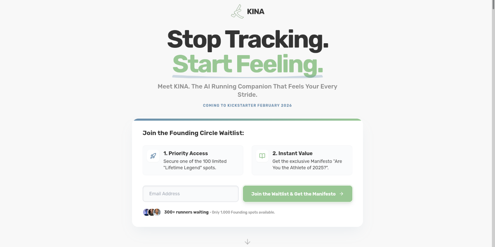

# KINA - The AI Running Companion (Landing Page)



This is the official landing page for the **KINA Kickstarter Campaign** (coming February 2026).
KINA is the first AI running companion that converses with you, contextualizing data through dialogue instead of raw
metrics.

**Live Demo:** [Insert your Vercel URL here]

## 🚀 Project Structure

This project is built with **React**, **TypeScript**, and **Vite**.

- **`src/components/`**: Contains all UI sections (Hero, Problem, Solution, etc.) and reusable atomic components (Buttons, Forms).
- **`src/assets/`**: Contains optimized local images (Logos, Founder photo, etc.).
- **`public/`**: Contains static assets like `favicon.png`, `robots.txt`, and Open Graph images.
- **`index.html`**: Entry point containing SEO meta-tags and Tailwind CSS CDN configuration.

## 🛠️ Tech Stack

- **Framework**: [React](https://react.dev/) (v18+)
- **Build Tool**: [Vite](https://vitejs.dev/)
- **Language**: [TypeScript](https://www.typescriptlang.org/)
- **Styling**: [Tailwind CSS](https://tailwindcss.com/) (via CDN for rapid prototyping)
- **Icons**: [Lucide React](https://lucide.dev/)

## 🏃‍♂️ Running Locally

1. **Clone the repository:**
   ```bash
   git clone https://github.com/kmmania/kina-landing-page.git
   cd kina-landing-page
   ```

2. **Install dependencies:**
   ```bash
   npm install
   ```

3. **Start the development server:**
   ```bash
   npm run dev
   ```
   Open `http://localhost:5173` in your browser.

## 📦 Building for Production

To create a production-ready build:

```bash
npm run build
```

This will generate a `dist` folder containing the compiled assets, ready for deployment.

## ☁️ Deployment on Vercel

This project is optimized for deployment on [Vercel](https://vercel.com).

1. Push your code to a GitHub repository.
2. Log in to Vercel and click **"Add New Project"**.
3. Import your GitHub repository.
4. Vercel will automatically detect the **Vite** framework.
    * Build Command: `npm run build`
    * Output Directory: `dist`
5. Click **Deploy**.

## 🎨 Asset Management

* **Images**: Place component-specific images in `src/assets/images/` and import them in TSX files.
* **Static Files**: Place favicons and social sharing images in `public/`.

## 📄 Legal

* **Privacy Policy**: Managed via modal in `components/Footer.tsx`.
* **Terms of Service**: Managed via modal in `components/Footer.tsx`.
* **GDPR**: Includes explicit consent checkboxes on all forms.

---

© 2025 KINA. All rights reserved.
